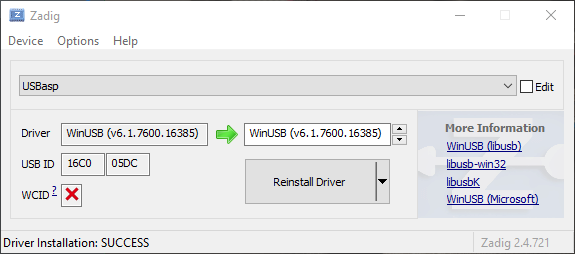

# Welcome to the Quick Start repository for the RFLeo!

Here you can find several demo programs and instructions for using the RFLeo.

## Setup

To use the RFLeo, you can either use the [Arduino IDE](https://www.arduino.cc/en/main/software) or [Atmel Studio](https://www.microchip.com/mplab/avr-support/atmel-studio-7).

We recommend the Arduino IDE for its ease of use and simplicity, but feel free to use any text-editor you prefer.

Here's an image of the RFLeo connected to the ICSP programmer. The programmer uses a 10-to-6 pin adapter to interface with the header on the device.

Here's an image of this setup:

### Configuring the driver

Install the driver for the ISP programmer using [Zadig](https://zadig.akeo.ie/) (Windows only). This step is not needed on MacOS.
Download the tool, and connect the ICSP cable. You will need the USBasp driver.

Open Zadig:
1.  Select  ` Options > List All Devices ` to ensure you see your device
1.  Choose ` USBASP ` from the dropdown
1.  Select ` WinUSB ` driver and press  ` Install Driver `

Your driver will be installed and you can use the USBasp programmer!

The installation should look like this

### Installing the bootloader

Installing The Arduino Bootloader:
Using the Arduino IDE:
1.  Select ` Tools > Board > Arduino Leonardo`
1.  Select ` Tools > Programmer > USBAsp`
1.  Select ` Tools > Burn Bootloader`

The burning process should take no longer than a minute. Once complete, restart the Arduino IDE, especially if you plan to bootload additional devices.

### Adding dependencies

The RFLeo uses the [Optimized High Speed NRF24L01](https://github.com/nRF24/RF24) Driver (RF24) to communicate with the nRF24l01 tranceiver module. You can install it with the arduino IDE.

1.  Select ` Tools > Manage Libraries`
1.  Select ` Type > All `
1.  Select ` Topic > Communication `
1.  Type into the filter box  ` RF24 `
1.  Select the library entitled `RF24 by TMRh20 `

You are recommended to view the [documentation for the library here.](https://tmrh20.github.io/RF24/)

Some important things to note when using the library:

1. The maximum payload size is 32-bytes.
1. 
